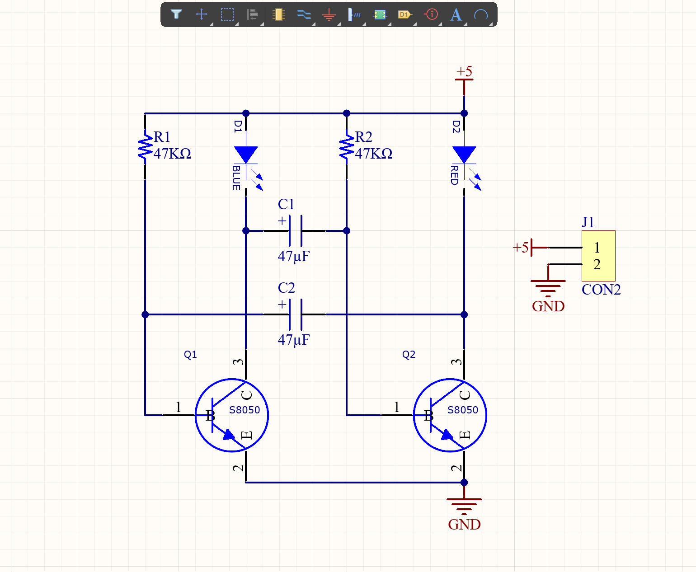

## 大学实验室硬件方向招新题目样例 [](gxist.cn)
## 该项目包含题目要求与培训资料
```shell
├─图片
├─招新培训
└─招新题目
    ├─单片机仿真
    ├─示例程序
    │  ├─11-2 蜂鸣器播放音乐
    │  └─音乐播放器可以运行
    └─考核电路图
        ├─考核三DIP-40
        ├─题目一考核AD
        └─题目二考核AD
            └─C51元件库
               ├─元件库
               ├─封装库
               └─集成库
```
## 寒假期间安排：考核一
寒假期间主要学习51单片机（在招新群提供学习资料，包括直播讲解），在开学第二周的周末验收（用学习板），验收实现在单片机上可以实现的任何小项目，项目内容不限，根据实现的功能进行评估与加分。

## 开学初安排：考核二
因为是在寒假安排其学习单片机作为考核一(包括统招的c语言)，所以考核二可以在开学第一周末进行培训，第四周初进行验收。
> 考核二主要考核是基本电路认识与手工板的制作。具体题目：多谐振荡流水灯(手工板)、51单片机最小系统设计(工业板)。

## 题目实例
### 题目一：多谐振荡流水灯
根据下方图示在Altium Designer或立创EDA画出该原理图，并生成PCB文件通过热转印在铜板上腐蚀生成电路，实现多谐振荡流水灯功能。
该题目会提供可能用到的AD元件封装库，元器件以及5×5cm的覆铜板。



题目考核要求
1. 掌握Altium Designer 或立创 EDA 软件的使用与制板流程；
2. 根据题目画出原理图(保留文件以备验收)、 PCB 并完成电路板的焊接且能实现流水功能；（合格）
3. 附加项：解释题目所给的电路图的原理（验收时提问）；
4. 布线整齐，焊接和布局美观，布线最小线宽20mil(0.508mm )。
5. 提供铜板： 5×5cm ，单面板。

### 题目二：51单片机最小系统
该题目提供基本常见元器件，芯片提供DIP-40封装的STC89C52RC芯片。不提供图例，收集查找相关资料，电路必须包含51最小系统基本外围电路（包含一颗可以用程序点亮的LED灯），但不限于其他功能板块，例如显示等。该电路设计完成后可用工业制板打样。

题目考核要求
1. 根据题目画出原理图(保留文件以备验收)、 生成PCB 提交打样（也可以手工制板）。
2. 收到电路板后，测试单片机基本功能，完成点灯操作。（合格）
3. 附加项：通过该电路板实现自定义的功能。
4. 布线整齐，焊接和布局美观。